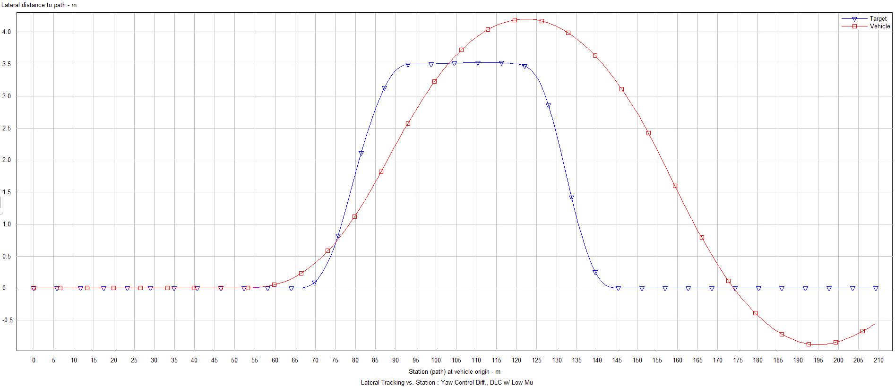
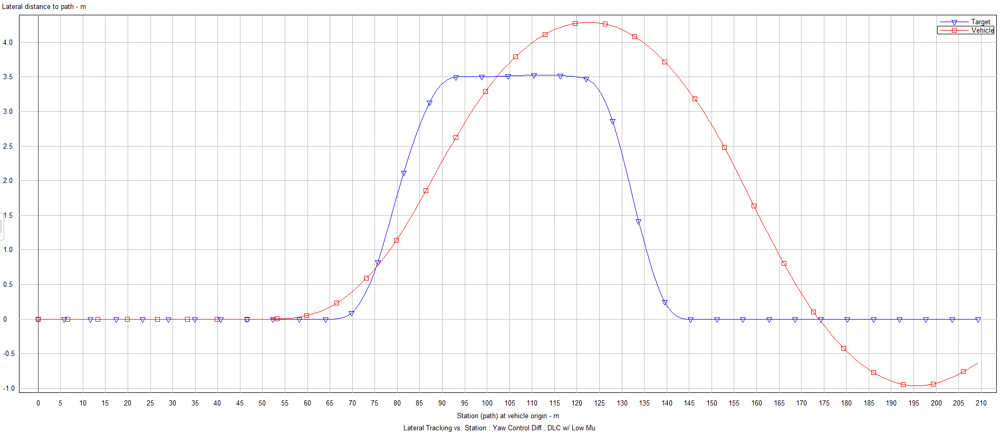

# Lab03.1 - Notes

Bmax generation function.

```matlab
function bmax = bmax(vx,vy)
    % parameters
    vcog1 = 40; % [m/s]
    b0 = 10; % deg
    b1 = 7; % deg

    % vcog
    vcog = sqrt(vx^2 + vy^2);
    vcog = 1/3.6*vcog;
    
    % beta max computation
    if vcog >= vcog1
        bmax = b0 - b1*(vcog/vcog1);
    else
        bmax = b0 - b1;
    end
end
```

The system reaches $\beta_{max}$ when the control gain is set below 0.33.

## Reference tracking

Standard case with control gain set to 0.72:



Modified borderline reachig $\beta_{max}$ case (control gain set to 0.33):



Not unstable.